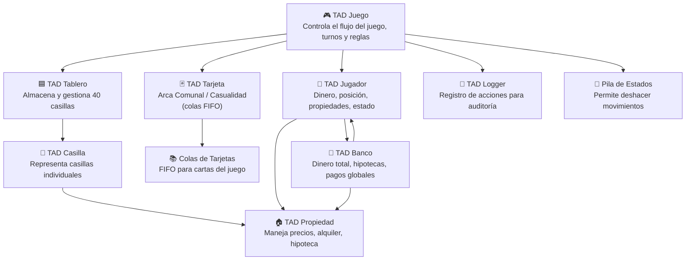

# 🚀 Bitácora del Proyecto: MonopolyHasbro

## 📋 Información General

- **Nombre del Proyecto:** MonopolyHasbro
- **Equipo:**  Alfonso Vega & Carlos Sánchez
- **Fecha de Inicio:** 2025-10-28
- **Fecha Estimada de Finalización:** 2025-12-10
- **Objetivo Principal:**  
  Implementar un simulador del juego Monopoly de Hasbro utilizando TADs personalizados en C++, siguiendo estrictamente las reglas del juego y empleando principios de diseño modular, estructuras de datos complejas y control de versiones en GitHub.

---

## 🗓️ Registro Diario

---

### 🔵 Día 1 — 2025-10-28

#### 🎯 Actividades Realizadas
- Revisión del documento de requisitos entregado por el profesor. (1.5h)
- Descarga y estudio de las reglas oficiales del Monopoly de Hasbro. (2h)
- Identificación preliminar de posibles TADs del sistema. (1h)

#### 🚧 Problemas Encontrados
- Ambigüedad en el documento inicial del profesor respecto a la estructura del tablero.  
  **Estado:** Resuelto  
  **Solución:** Analizar las reglas oficiales y extraer estructura real usada en el juego.

#### ✅ Decisiones Clave
- Basar todo el diseño del sistema en las reglas oficiales de Hasbro.  
- Trabajar con arquitectura modular por TAD.

#### ➡️ Próximos Pasos
- Definir atributos de cada TAD.
- Crear el primer borrador de la estructura del repositorio.

---

### 🔵 Día 2 — 2025-10-29

#### 🎯 Actividades Realizadas
- Diseño conceptual de los TADs base: Jugador, Propiedad, Banco, Casilla, Tarjeta. (3h)
- Revisión cruzada entre Carlos y Alfonso para validar responsabilidades de cada módulo. (1h)

#### 🚧 Problemas Encontrados
- Se plantearon TADs innecesarios que complicaban el futuro del proyecto.  
  **Estado:** Resuelto  
  **Solución:** Alfonso revisó y filtró los TADs esenciales.

#### ✅ Decisiones Clave
- Limitar TADs únicamente a aquellos con responsabilidad real dentro del juego.
- Evitar mezclar lógica del tablero con lógica del banco.

#### ➡️ Próximos Pasos
- Crear repositorio en GitHub e inicializar carpetas.

---

### 🔵 Día 3 — 2025-11-02

#### 🎯 Actividades Realizadas
- Creación del repositorio GitHub. (0.5h)
- Configuración de carpetas `/include`, `/src`, `/docs`, `/assets`, `/data`. (1h)
- Inicio de la bitácora en formato Markdown. (1h)

#### 🚧 Problemas Encontrados
- Dudas iniciales sobre cómo estructurar correctamente la bitácora.  
  **Estado:** Resuelto  
  **Solución:** Se investigaron plantillas e integró una plantilla profesional como esta.

#### ✅ Decisiones Clave
- Carlos liderará documentación y GitHub.
- Alfonso liderará implementación de TADs.

#### ➡️ Próximos Pasos
- Implementar TAD Jugador y Banco.

---

### 🔵 Día 4 — 2025-11-05

#### 🎯 Actividades Realizadas
- Implementación inicial de Jugador.cpp y Jugador.h. (3h)
- Implementación de Banco.cpp y Banco.h según lógica de Hasbro (2h)

#### 🚧 Problemas Encontrados
- Errores en sincronización entre ramas *main* y *master*.  
  **Impacto:** Medio  
  **Estado:** Resuelto parcialmente  
  **Solución:** Mover todo trabajo real a la rama **main**.

#### ✅ Decisiones Clave
- Se abandona la rama *master*.
- Oficializar *main* como la rama de desarrollo activo.

#### ➡️ Próximos Pasos
- Implementar TAD Propiedad.
- Cargar los datos desde archivos `.txt`.

---

### 🔵 Día 5 — 2025-11-10

#### 🎯 Actividades Realizadas
- Creación de archivos `.txt` que representan propiedades y tarjetas oficiales del Monopoly. (2h)
- Implementación de TAD Propiedad con su lógica de hipotecas, precios y alquileres. (3.5h)

#### 🚧 Problemas Encontrados
- Desorden en los archivos del repositorio.  
  **Estado:** Resuelto  
  **Solución:** Reestructuración completa de carpetas por Carlos.

#### ✅ Decisiones Clave
- Establecer un estándar de nombres de archivo y carpetas.
- Separar toda data del juego en `/data`.

#### ➡️ Próximos Pasos
- Implementar TAD Tarjeta y colas.

---

### 🔵 Día 6 — 2025-11-15

#### 🎯 Actividades Realizadas
- Implementación de TAD Tarjeta con colas FIFO para Arca Comunal y Casualidad. (3h)
- Lectura de tarjetas desde archivos `.txt`. (1h)

#### 🚧 Problemas Encontrados
- Errores al mezclar ramas por histories no relacionadas (`fatal: unrelated histories`).  
  **Estado:** Resuelto  
  **Solución:** Uso de flags `--allow-unrelated-histories` y depuración del archivo corrupto.

#### ✅ Decisiones Clave
- Separar mecánica de tarjetas del TAD Jugador.

#### ➡️ Próximos Pasos
- Implementar TAD Tablero.

---

### 🔵 Día 7 — 2025-11-18

#### 🎯 Actividades Realizadas
- Implementación completa de TAD Casilla. (1.5h)
- Implementación de TAD Tablero leyendo desde archivos y construyendo nodos. (3h)
- Revisión final a los TADs y documentación de Pre/Post condiciones. (1h)

#### 🚧 Problemas Encontrados
- Error al agregar Tablero.cpp debido a ruta equivocada en Git Bash.  
  **Estado:** Resuelto  
  **Solución:** Usar rutas relativas reales (`src/Tablero.cpp`).

#### ✅ Decisiones Clave
- Mantener un patrón claro de nombres y rutas para evitar errores futuros.

#### ➡️ Próximos Pasos
- Comenzar implementación del TAD Juego.
- Integrar todos los TADs en flujo lógico.

---

## ✨ Conclusión Final
El proyecto ha progresado notablemente gracias a la colaboración equilibrada entre ambos integrantes, con una división de responsabilidades clara y reuniones periódicas que permitieron revisar avances, resolver problemas y mantener coherencia entre el diseño y la implementación.

---

#### Arquitectura General del Proyecto

# 📘 Historia del Proyecto: El Camino detrás de MonopolyHasbro  

Desarrollar **MonopolyHasbro** ha sido más que un simple ejercicio de programación: ha sido un camino lleno de decisiones, aprendizajes, retrocesos, errores, reconstrucciones y, sobre todo, crecimiento conjunto.

El proyecto inició con un paso fundamental: **leer el documento entregado por el profesor**, el cual contenía las generalidades y requisitos del sistema. Pero muy rápido nos dimos cuenta de que el proyecto era mucho más profundo de lo que parecía. Para tener una arquitectura clara, estudiamos las **reglas oficiales del Monopoly de Hasbro**, identificando los elementos esenciales que más tarde se convertirían en los **TADs base del juego**.

Durante esta etapa surgieron varios conceptos erróneos y estructuras mal pensadas. Algunos TADs eran innecesarios, otros iban a complicar el proyecto en fases posteriores. En este punto, la claridad de Alfonso fue fundamental: él detectó inconsistencias y ayudó a depurar las primeras ideas, evitando problemas estructurales que habríamos tenido más adelante. Entre ambos logramos quedarnos con los TAD esenciales: Jugadores, Banco, Tarjetas, Propiedades, Tablero, Casilla y Juego.

Mientras Alfonso impulsaba la parte más técnica del código, yo (Carlos) me encargaba de organizar los documentos, estudiar la lógica general, revisar información externa, preparar archivos, mantener carpetas ordenadas y gestionar el control de versiones en GitHub. Ambos contribuíamos a la lógica del proyecto, pero cada uno se enfocaba en su rol principal para mantener un flujo organizado.

Más adelante surgió la necesidad de elaborar una **bitácora formal**, pero al inicio no sabíamos cómo debía ser. Revisamos plantillas y modelos profesionales, y con esa información construimos nuestra propia bitácora, más completa, útil y clara para registrar el proceso real del proyecto.

No todo fue lineal. Tuvimos un período de **baja comunicación** durante 3 - 4 días debido a situaciones personales y académicas. Ese silencio generó un pequeño retroceso, pero también fue un punto de reflexión. Decidimos mejorar la coordinación, realizar reuniones más frecuentes, revisar tareas juntas y mantener un ambiente de trabajo colaborativo y respetuoso.

Desde ese momento, el proyecto tomó fuerza. Las ideas empezaron a conectarse mejor, y cada módulo implementado -el banco, las propiedades, las tarjetas, la lógica del tablero, las colas, las operaciones financieras, los estados del juego y las estructuras hash— se convirtió en un avance significativo.

También enfrentamos obstáculos técnicos importantes:  
- Conflictos y errores en GitHub.
- Archivos en rutas incorrectas.
- Diferencias entre ramas.
- Commits desordenados.
- Problemas de integración entre TADs.
- Reestructuraciones de código necesarias para mantener coherencia.

Sin embargo, cada error nos enseñó algo nuevo: a mantener orden, a documentar correctamente, a versionar con responsabilidad y a mejorar la arquitectura del sistema.

Hoy el proyecto cuenta con una estructura clara, TADs robustos, archivos bien organizados, reglas fieles al Monopoly original y un flujo lógico que integra correctamente a todos los componentes. Pero más importante que todo esto, aprendimos que programar en equipo implica **comunicación, paciencia, rol definido, respeto por el proceso del otro y capacidad de adaptación**.

**MonopolyHasbro** no es solo un proyecto académico:  
es una experiencia de aprendizaje profundo y un ejemplo de cómo dos personas, aun con estilos diferentes, pueden construir algo sólido trabajando juntas.

En definitiva:  
Este proyecto nos enseñó a programar mejor, a organizarnos mejor y a ser un mejor equipo.
